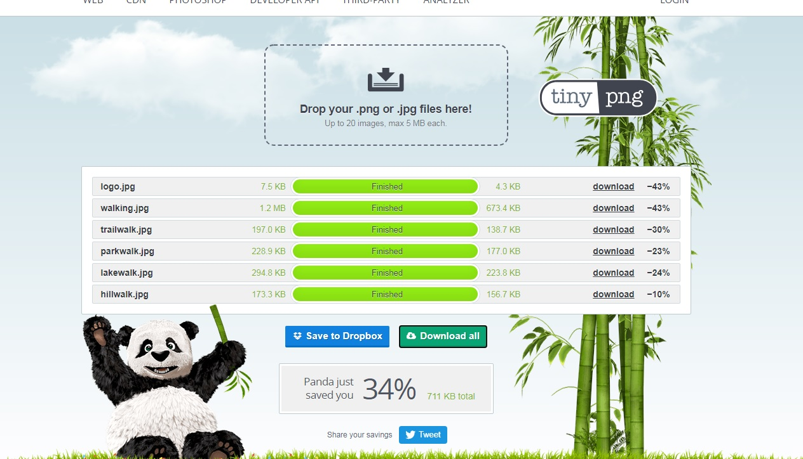
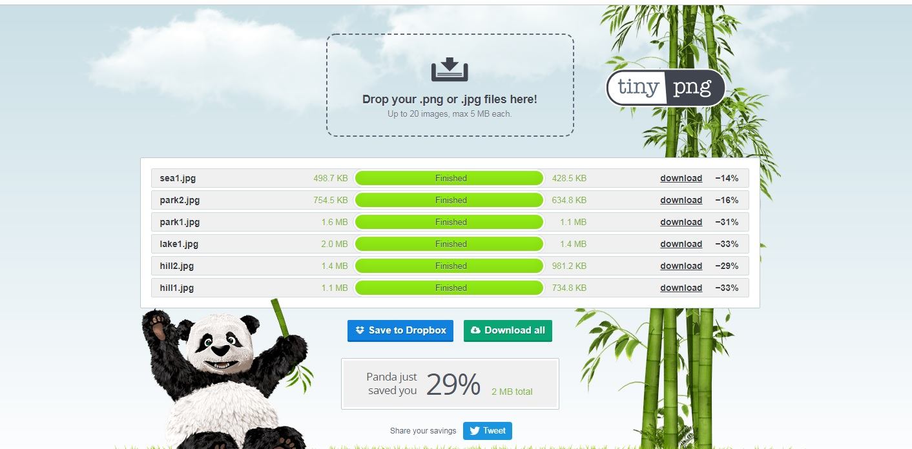

# Description
*This is a fictitious application*
> Walking rocks is an app fror people who are interested in walking, to learn about walks in their location.
> Walking rocks will publish their top 6 walks every month with walks included that will suit all abilities from beginners, familes to experienced walkers.
# Deployment and Demo
Website has been deployed to [GitHub Pages](https://nfox13.github.io/MS2--Interactive-Frontend-Development/).
# Wireframe
The wireframe was designed using [Wireframe.cc]( https://wireframe.cc/) links to the original version can be found below:
- [Wireframe original idea](assets/images/wireframe.jpg)
# UX
I have opted for a simple design that I feel gets the information to the client effectively and directs them to the areas that they need to go.
- The one page design should reduce confusion and give the user a pleasant, stressfree experience.

In order to improve user experience and website loading speed, I have compressed the images using [tinypng.com](https://tinypng.com/) and the reduction in image size has been 34% and 29%.

# Visual Identity
- [Logo maker](https://www.logomaker.com/) for the logo design
- [Coolers](https://coolors.co/) for generating my colour scheme
# User Stories
Users:
- As a user, I'd like to know what walking facilities are close to my location
- As a user, I'd like to learn more about what walks are available for various abilities
- As a user, I'd like to know if there are walks available for small children/families 
App provider:
- As an app provider, I'd like to see where the demand is for walking and what services could be offered to the walkers 
# Testing
Website has been tested using [GTmetrix](https://gtmetrix.com/reports/nfox13.github.io/VNjoX5k6/) see results below:

During testing my google maps API loads initially then stops and gives an error, I have tried to rectify this but unfortunately I did not have the time to get this working correctly before my submission deadline.
To improve on the app with more time I would tidy up the card images and hero logo. I will play around with the walking rocks logo and make it more sleek and blend it in to the hero logo.
Most importantly, I would rectify the issues with the google maps API. 
HTML and CSS has been tested using W3C validator and the javascript has been tested using jshint.com

# Technologies
- [Bootstrap](https://getbootstrap.com/)
- Googlemaps API

# Media
I have used different resources for images, my logo, colour scheme etc.
All are listed below:
- [Font Awesome](https://fontawesome.com/) for the icons used on this site
- [Logo maker](https://www.logomaker.com/) for the logo design
- [Unsplash](https://unsplash.com/) for all the images
- [Am I Responsive](http://ami.responsivedesign.is/) for the responsive image in the UX section
- [Coolers]( https://coolors.co/) for generating my colour scheme
# Thanks to
I would also like to thank the following for their part in this project
- Font awesome
- Bootstrap
- Coolers
- Logo maker
- Unsplash
- Github
- Gitpod
- Code Institute tutorials
- W3 schools
All of the above had an input or gave inspiration to various elements of this project