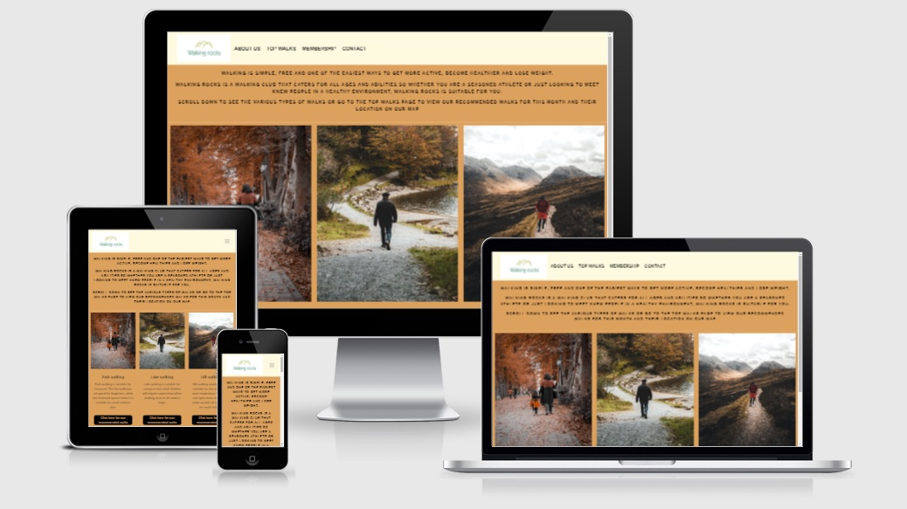
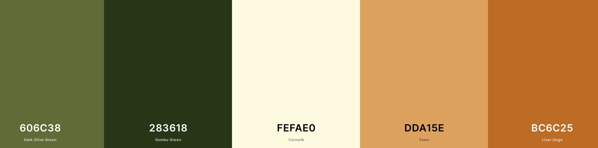
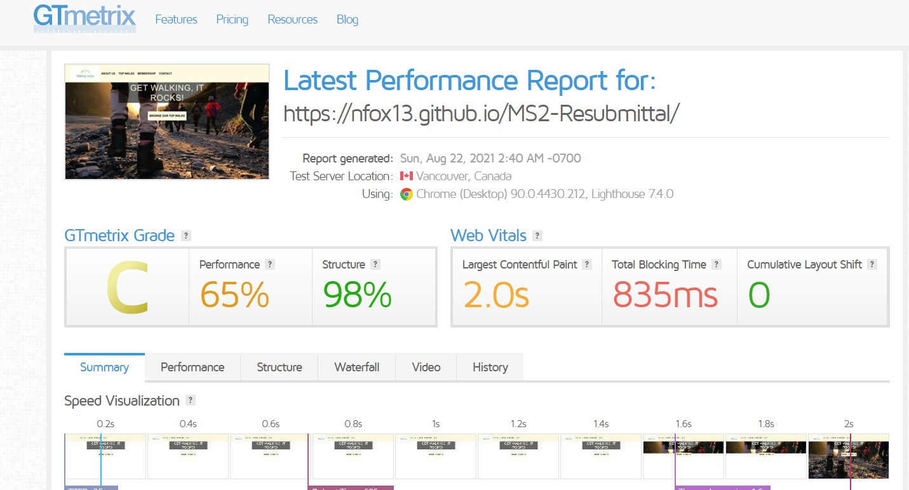
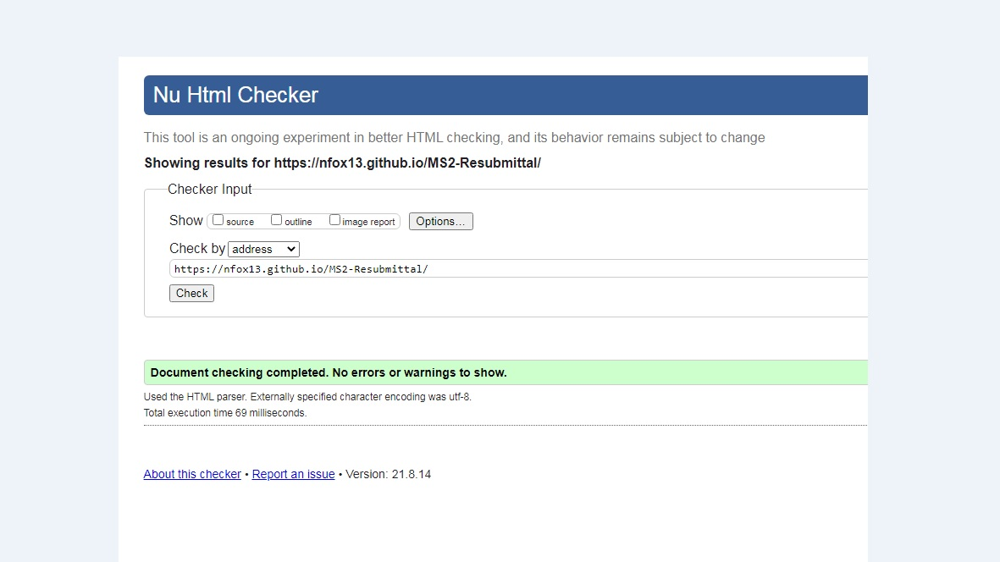
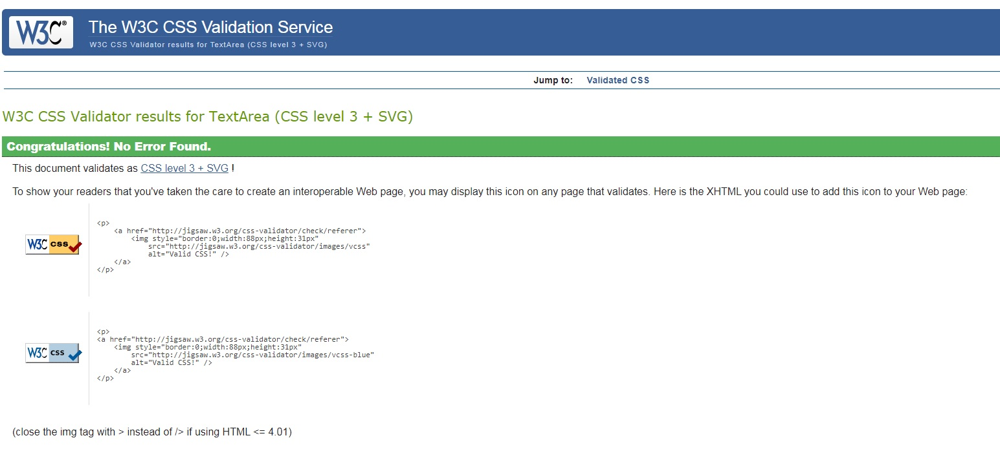
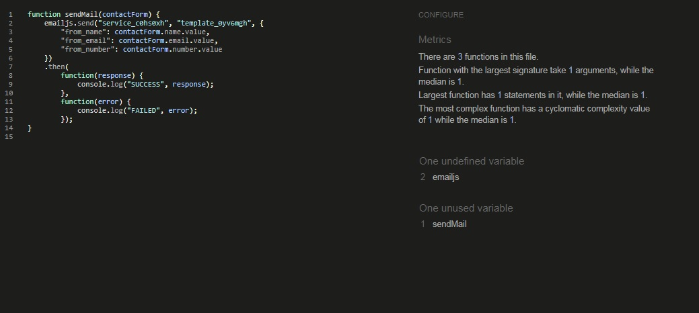
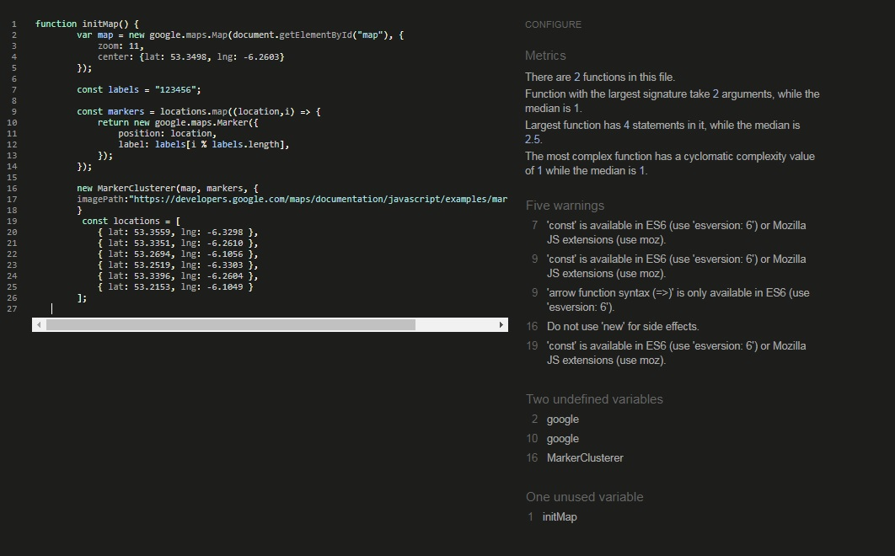
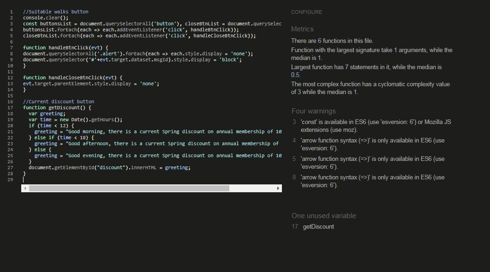

# Description
*Walking rocks are a fictitious group*
> Walking rocks is a walking group set up to encourage people to get out walking and get more activity in their lifestyle.
> The website was created for people who are interested in walking and would be interested in joining the Walking rocks group.
> As more people are becoming increasingly health conscious, this website would like to inform people where there are recommended walks where they can walk safely and even meet other people from the group. 
> Walking rocks will publish their top 6 walks every month with walks included that will suit all abilities from beginners, familes to experienced walkers.
> Annual membership entitles members to receive updates and join the group on an annual group walk.

# Deployment
Website has been deployed to [GitHub Pages](https://nfox13.github.io/MS2-Resubmittal/).

index.html is the home landing page with nabar links to all other pages

  **Process**
   1. Created a Github account at https://github.com My account: https://github.com/NFox13

   2. Created Github Repo using Code Institute template: https://github.com/NFox13/MS2-Resubmittal

   3. To deploy the project and see it live go to Settings tab, scroll down to the heading: GitHub Pages. Under the Source setting, Use drop-down menu to select master branch as a publishing source and save. Refresh the github page, and you are then given a url where your page is published. The site is now published on gitHub pages at https://nfox13.github.io/MS2-Resubmittal/

   4. To run this code on your local machine, go to my respository at https://github.com/NFox13/MS2-Resubmittal on the home page on the right hand side there is a button that says, "Code", this button will give you the options to clone with HTTPS, open in desktop or download as a zip file. To clone the repository using HTTPS, under "Clone with HTTPS", click the clone icon. To clone the repository using an SSH key, including a certificate issued by your organization's SSH certificate authority, click Use SSH, then click the clone icon. To clone a repository using GitHub CLI, click Use GitHub CLI, then click the clone icon.
   
   5. Open Git Bash. Change the current working directory to the location where you want the cloned directory. Type git clone, and then paste the URL you copied earlier.
   $ git clone https://github.com/NFox13/MS2-Resubmittal
   Press Enter to create your local clone.

# Wireframe
The wireframe was designed using [Wireframe.cc]( https://wireframe.cc/) links to the original version can be found below:
- [Wireframe original idea](assets/images/wireframe.jpg)
- The original concept was a single page design but, after receiving negative feedback for navigation, I changed the design to a multi page design with navbar.
# UX
I have opted for a simple design that I feel gets the information to the client effectively and directs them to the areas that they need to go.
- The multi page design should reduce confusion and give the user a pleasant, stressfree experience.
- The user lands on a home page showing a group of people walking with a prompt to "get walking, it rocks" which is a play with the app name.
- From the landing page the options are clearly shown and the user can choose to read about the group, check out the top walks, review membership costs or contact the team.
- The about us page gives a little narrative about the group and the types of walks. On clicking the type of walk the user is interested in they will be notified of recommeneded walks of that type.
- The top walks page shows the top 6 walks for that month and conveniently shows the walk location on the map with corresponding numbers.
- The membership page informs the user of the membership fee's should they choose to join and also a clickable discount button advises of the current discount with a changing greeting depending on the time of day.
- The contact page gives the groups contact details with clickable links for email and telephone. There is also a contact form that sends the details to the app provider and returns an email to the user that a member of the team would contact them as soon as possible.
# Responsiveness
The responsiveness was developed so users can have a pleasant experience on desktop, laptop, tablet or mobile.
I have tested the responsiveness of the webpage manually using the developer tools inspect option but on deployment I tested the responsiveness again using [Am I Responsive](http://ami.responsivedesign.is/).

# Compress images
In order to improve user experience and website loading speed, I have compressed the images using [tinypng.com](https://tinypng.com/) and the reduction in image size has been 34% and 29% which reduced my images by 2711kb.

# Visual Identity
The Logo and colour were created with nature in mind. Walking rocks as a name has walking and rocks in it which are also keeping to the theme. The people that we expect to join our group are interesting in the earth, health, nature and wellbeing and I feel the earthy colours, name and logo add to this.
- [Logo maker](https://www.logomaker.com/) for the logo design

- [Coolers](https://coolors.co/) for generating my colour scheme

# User Stories
Users:
- As a user, I would like to find out about recommended walks
- As a user, I would like to be able to see where the recommended walks are located and how to travel to the location
- As a user, I would like to learn more about what walks are suitable for various abilities
- As a user, I would like to know if there are recommended walks suitable for small children/families 
- As a user, I would like to join a walking group and meet people with similar interests

App provider:
- As an app provider, I would like to create a walking group
- As an app provider, I would like to recommend suitable walks monthly and give some information on each walk 
- As an app provider, I would like to provide a service to help people with similar interests come together
- As an app provider, I would like to offer walking attire at a reduced rate to members of the walking group and perhaps add an ecommerce section to the app in the future
- As an app provider, I would like to promote a healthier lifestyle

## Future improvements
- To improve on the app with more time I would like to include a forum for people to comment to arrange walks between members and also a calculator for calculating membership and an option to sign up and pay membership.
- I would also like to add an ecommerce section to promote and sell walking clothing and accessories and maybe healthy foods.

# Testing

### Navigation

All links were checked and work as intended.

#### Mobile Navigation

A hamburger style collapse is in operation for users on small screen devices.

#### Desktop Navigation

A full width navbar is in operation allowing users to see their options in an easy to follow format.

#### Contact form

The contact form uses emailjs, this has been tested and works as intended.

On submittal of the form the app provider receives an emal with the contact details of the person contacting and then the person contacting receives an email to say that a member of the Walking rocks team will be in contact. The form refreshes to show it has been submitted.

### Responsiveness

This application was tested for responsiveness across a variety of devices to ensure content remained readable and editable on various screen sizes.

The navigation, layout and various functionalities were tested across various screen sizes with Chrome Developer Tools.

These tests were performed on the following devices and browsers:

    Samsung Internet on Samsung Galaxy S7
    Chrome and Firefox on Windows based 15" Laptop
    Chrome and Firefox on Windows based 24" Desktop

Tests were conducted by various friends and family.

Website has been tested using [GTmetrix](https://gtmetrix.com/) see results below:

HTML has been tested using W3C validator

CSS has been tested using W3C Jigsaw validator

Javascript has been tested using jshint.com

# Technologies
- HTML
- CSS
- JavaScript
- [Bootstrap](https://getbootstrap.com/)
- [Googlemaps-API] (https://developers.google.com/maps)

# Media
I have used different resources for images, my logo, colour scheme etc.
All are listed below:
- [Font Awesome](https://fontawesome.com/) for the icons used on this site
- [Logo maker](https://www.logomaker.com/) for the logo design
- [Unsplash](https://unsplash.com/) for all the images
- [Am I Responsive](http://ami.responsivedesign.is/) for the responsive image in the UX section
- [Coolers]( https://coolors.co/) for generating my colour scheme

### Image credits
- Photo by <a href="https://unsplash.com/@henry2cute?utm_source=unsplash&amp;utm_medium=referral&amp;utm_content=creditCopyText">Henry Xu</a> on <a href="https://unsplash.com/s/photos/walking-group?utm_source=unsplash&amp;utm_medium=referral&amp;utm_content=creditCopyText">Unsplash</a>
- Photo by <a href="https://unsplash.com/@krisijanis?utm_source=unsplash&amp;utm_medium=referral&amp;utm_content=creditCopyText">Krisjanis Mezulis</a> on <a href="https://unsplash.com/s/photos/hill-walking?utm_source=unsplash&amp;utm_medium=referral&amp;utm_content=creditCopyText">Unsplash</a>
- Photo by <a href="https://unsplash.com/@illiyapresents?utm_source=unsplash&amp;utm_medium=referral&amp;utm_content=creditCopyText">Illiya Vjestica</a> on <a href="https://unsplash.com/s/photos/lake-walking?utm_source=unsplash&amp;utm_medium=referral&amp;utm_content=creditCopyText">Unsplash</a>
- Photo by <a href="https://unsplash.com/@mralidoost?utm_source=unsplash&amp;utm_medium=referral&amp;utm_content=creditCopyText">Mohammadreza alidoost</a> on <a href="https://unsplash.com/s/photos/park-walking?utm_source=unsplash&amp;utm_medium=referral&amp;utm_content=creditCopyText">Unsplash</a>
- Photo by <a href="https://unsplash.com/@jamie_davies?utm_source=unsplash&utm_medium=referral&utm_content=creditCopyText">Jamie Davies</a> on <a href="https://unsplash.com/s/photos/hill-walk?utm_source=unsplash&utm_medium=referral&utm_content=creditCopyText">Unsplash</a>
- Photo by <a href="https://unsplash.com/@nathan_w?utm_source=unsplash&utm_medium=referral&utm_content=creditCopyText">Nathan Watson</a> on <a href="https://unsplash.com/s/photos/hill-walk?utm_source=unsplash&utm_medium=referral&utm_content=creditCopyText">Unsplash</a>
- Photo by <a href="https://unsplash.com/@el_chicho?utm_source=unsplash&utm_medium=referral&utm_content=creditCopyText">Narciso Arellano</a> on <a href="https://unsplash.com/s/photos/lake?utm_source=unsplash&utm_medium=referral&utm_content=creditCopyText">Unsplash</a>
- Photo by <a href="https://unsplash.com/@mbenna?utm_source=unsplash&utm_medium=referral&utm_content=creditCopyText">Mike Benna</a> on <a href="https://unsplash.com/s/photos/park?utm_source=unsplash&utm_medium=referral&utm_content=creditCopyText">Unsplash</a>
- Photo by <a href="https://unsplash.com/@giginkrishnan?utm_source=unsplash&utm_medium=referral&utm_content=creditCopyText">Gigin Krishnan</a> on <a href="https://unsplash.com/s/photos/park?utm_source=unsplash&utm_medium=referral&utm_content=creditCopyText">Unsplash</a>
- Photo by <a href="https://unsplash.com/@sarahberriman?utm_source=unsplash&utm_medium=referral&utm_content=creditCopyText">Sarah Berriman</a> on <a href="https://unsplash.com/s/photos/sea-walk?utm_source=unsplash&utm_medium=referral&utm_content=creditCopyText">Unsplash</a>

# Thanks to
I would also like to thank the following for their part in this project
- Font awesome
- Bootstrap
- Coolers
- Logo maker
- Unsplash
- Github
- Gitpod
- Code Institute tutorials
- W3 schools
- Stackoverflow
- [Felipe Alarcon](https://github.com/fandressouza) my course mentor for his feedback.
- Family and friends for their help in testing, support and advice.
- All of the above had an input or gave inspiration to various elements of this project