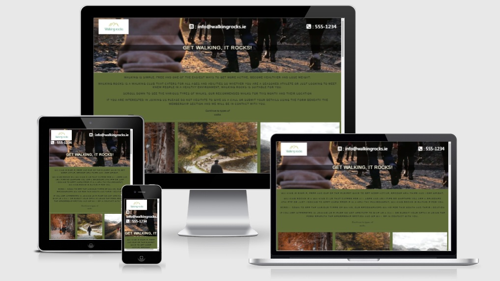
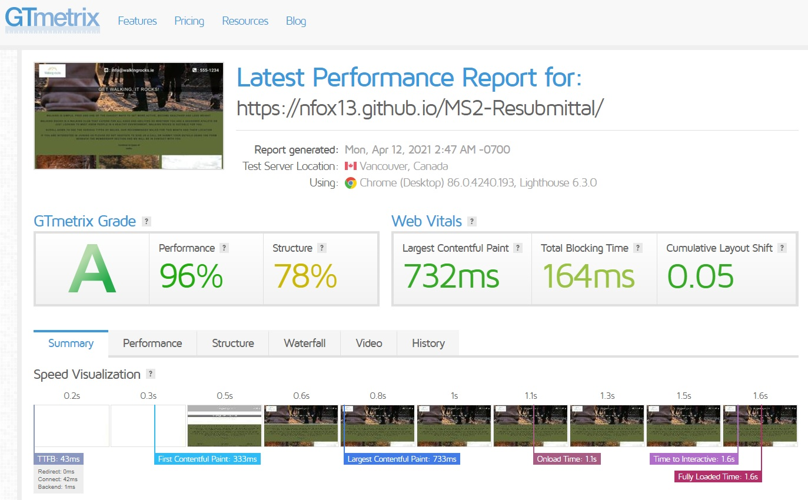
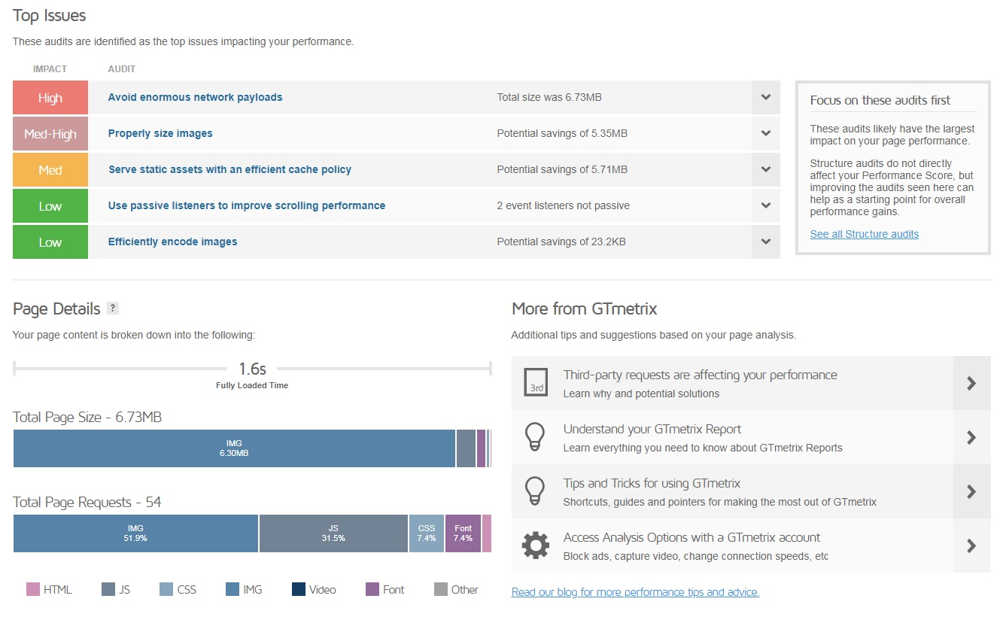
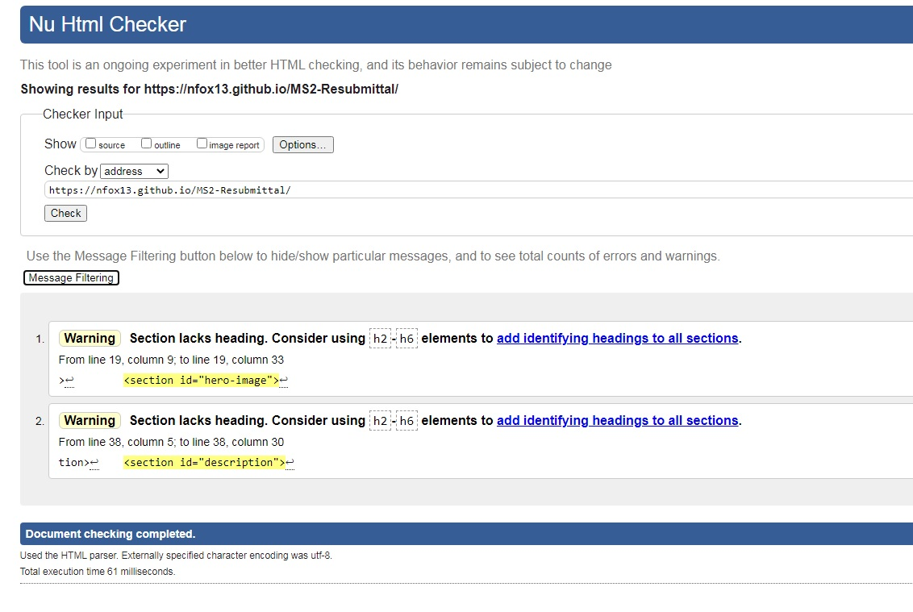
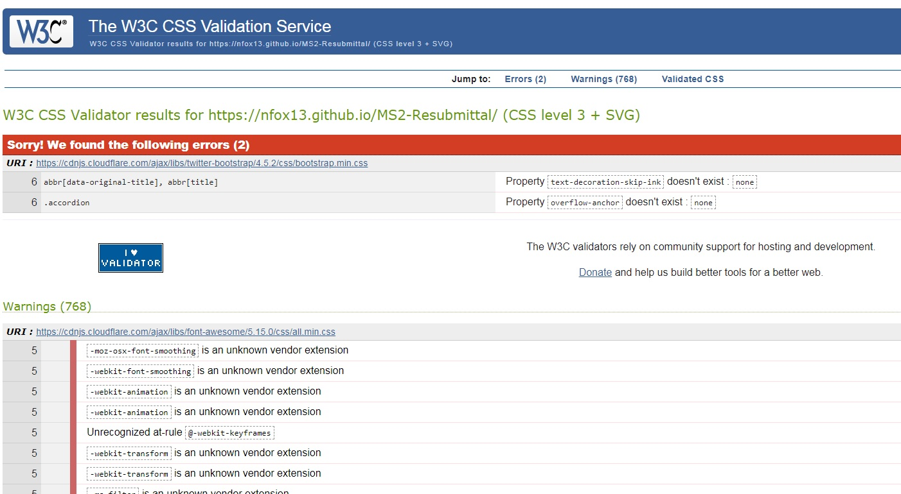
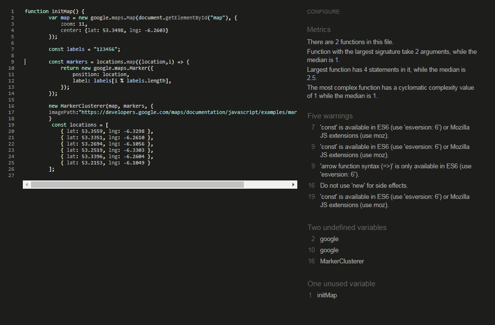
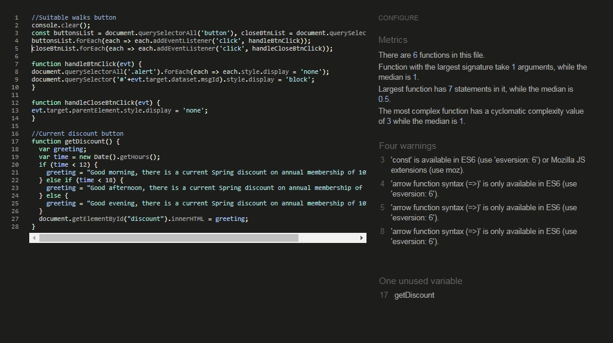

# Description
*Walking rocks are a fictitious group*
> Walking rocks is a walking group set up to encourage people to get out walking and get more activity in their lifestyle.
> The website was created for people who are interested in walking and would be interested in joining the Walking rocks group.
> As more people are becoming increasingly health conscious, this website would like to inform people where there are suitable walks where they can walk safely and even meet other people from the group. 
> Walking rocks will publish their top 6 walks every month with walks included that will suit all abilities from beginners, familes to experienced walkers.
> Annual membership entitles members to receive updates and join the group on an annual group walk.
# Deployment and Demo
Website has been deployed to [GitHub Pages](https://nfox13.github.io/MS2-Resubmittal/).
- On deployment of the website I realised that my images would not load when deployed so I had to rectify the image paths.
# Wireframe
The wireframe was designed using [Wireframe.cc]( https://wireframe.cc/) links to the original version can be found below:
- [Wireframe original idea](assets/images/wireframe.jpg)
# UX
I have opted for a simple design that I feel gets the information to the client effectively and directs them to the areas that they need to go.
- The one page design should reduce confusion and give the user a pleasant, stressfree experience.
# Responsiveness
I have tested the responsiveness of the webpage manually using the developer tools inspect option but on deployment I tested the responsiveness again using [Am I Responsive](http://ami.responsivedesign.is/).

# Compress images
In order to improve user experience and website loading speed, I have compressed the images using [tinypng.com](https://tinypng.com/) and the reduction in image size has been 34% and 29% which reduced my images by 2711kb.

# Visual Identity
The Logo and colour were created with nature in mind. Walking rocks as a name has walking and rocks in it which are also keeping to the theme. The people that we expect to join our group are interesting in the earth, health, nature and wellbeing and I feel the earthy colours, name and logo add to this.
- [Logo maker](https://www.logomaker.com/) for the logo design

- [Coolers](https://coolors.co/) for generating my colour scheme

# User Stories
Users:
- As a user, I'd like to know what walking facilities are close to my location
- As a user, I'd like to learn more about what walks are available for various abilities
- As a user, I'd like to know if there are walks available for small children/families 
App provider:
- As an app provider, I'd like to see where the demand is for walking and what services could be offered to the walkers 
# Testing
Website has been tested using [GTmetrix](https://gtmetrix.com/) see results below:

HTML has been tested using W3C validator

CSS has been tested using W3C Jigsaw validator

Javascript has been tested using jshint.com

To improve on the app with more time I would like to include a forum for people to comment to arrange walks between members and also a calculator for calculating membership and an option to sign up and pay membership.

# Technologies
- [Bootstrap](https://getbootstrap.com/)
- [Googlemaps-API] (https://developers.google.com/maps)

# Media
I have used different resources for images, my logo, colour scheme etc.
All are listed below:
- [Font Awesome](https://fontawesome.com/) for the icons used on this site
- [Logo maker](https://www.logomaker.com/) for the logo design
- [Unsplash](https://unsplash.com/) for all the images
- [Am I Responsive](http://ami.responsivedesign.is/) for the responsive image in the UX section
- [Coolers]( https://coolors.co/) for generating my colour scheme
# Thanks to
I would also like to thank the following for their part in this project
- Font awesome
- Bootstrap
- Coolers
- Logo maker
- Unsplash
- Github
- Gitpod
- Code Institute tutorials
- W3 schools, Which I find extremely useful as a basis to most of my code
- Stackoverflow
- All of the above had an input or gave inspiration to various elements of this project